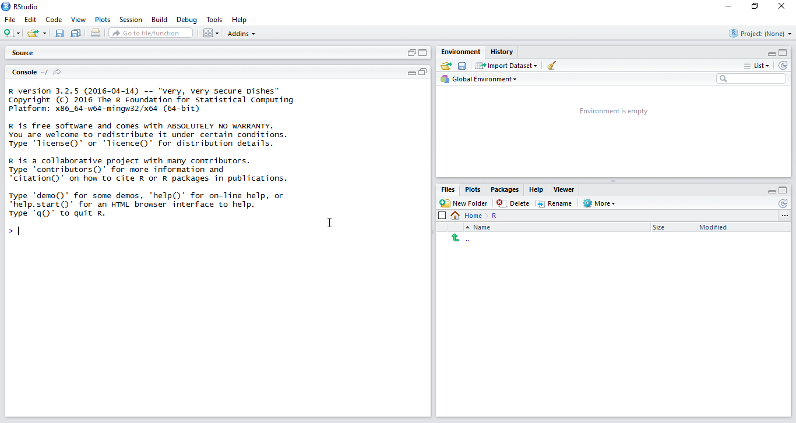

Vorbereitungen und Hinweise
---------------------------

Während der gesamten Installation sollten Sie eine stabile
Internetverbindung haben. Für die Installation müssen Sie ein wenig Zeit
einplanen, der Aufwand ist aber nur einmalig nötig! Bitte beachten Sie
diese Hinweise. Bei Problemen können Sie sich, bitte mit einer möglichst
genauen Beschreibung (z. B. Fehlermeldung, Betriebssystem etc.), an
<R@fom.de> wenden.

-   [**R**](https://www.r-project.org/) ist das Basisprogramm
-   [**R Studio**](https://www.rstudio.com/) ist eine komfortable
    Entwicklungsumgebung für R und bietet zusätzliche Tools, wie z. B.
    Dokumentenerstellung etc.
-   [**mosaic**](https://cran.r-project.org/web/packages/mosaic/) ist
    ein Zusatzpaket, welches u. a. eine vereinheitlichte R Syntax bietet
-   [**R
    Commander**](http://socserv.socsci.mcmaster.ca/jfox/Misc/Rcmdr/) ist
    ein Zusatzpaket für R, welches eine grafische Benutzeroberfläche für
    einen wichtigen Teil der Funktionalität von R zur Verfügung stellt

### Windows

Sie müssen *keine* Administrationsrechte besitzen um R und R Studio
installieren zu können. Sie können in Ihr lokales Verzeichnis oder aber
auch z. B. auf einen USB-Stick installieren.

### Mac OS X

Einige Zusatzpakete wie z. B.`Rcmdr` benötigen das X11 Windows System.
Dies muss vorab - sofern noch nicht vorhanden - von der Seite
<http://www.xquartz.org/> installiert werden. Nach der Installation muss
der Computer neu gestartet werden. Neuere Versionen von R werden nur
noch für OS X ab Version 10.9 (Mavericks) oder neuer zur Verfügung
gestellt. Daher lohnt sich auch aus diesem Grund evt. ein Update.

1.  Installation [XQuartz](http://www.xquartz.org/)
2.  Neustart Computer
3.  Fortfahren mit der Installation von R und R Studio

*Hinweis:* Bei der Verwendung des R Commanders unter Mac kann es ggf.
nötig sein nach der Installation dort eine Einstellung zu ändern: es
kann es sein, dass der R Commander teilweise sehr langsam wird. Dies
können Sie im R Commander Menü über
`Extras -> MAC OS X app nap für R.app managen ...` verhindern, in dem
Sie die Option `aus` wählen.

### Linux

Keine besonderen Vorbereitungen nötig.

Installation
------------

Installieren Sie zunächst R und anschließend R-Studio.

### Installation von R

Installieren Sie die für Ihr System aktuelle Version von R von der Seite

<https://www.r-project.org/>.

Welchen "Mirror" (Server) Sie verwenden ist dabei egal, z. B. den Cloud
Mirror von R Studio:

1.  Windows: <https://cran.rstudio.com/bin/windows/base/>
2.  Mac OS X: <https://cran.rstudio.com/bin/macosx/>

Sie können in der Regel die Standardeinstellungen innerhalb der
Installation verwenden.

### Installation von R-Studio (Desktop)

Sie können R-Studio (Desktop-Version) von der Seite

<https://www.rstudio.com/products/rstudio/download/>

entsprechend Ihrem Betriebssystem herunterladen und anschließend
installieren.

### Installation von Zusatzpaketen

Die Grundinstallation ist jetzt abgeschlossen. R-Studio erkennt in der
Regel automatisch R, und Sie können beides durch klicken auf das
Programm bzw. das Icon mit dem Logo von R-Studio starten. (Die
ausführbare Datei finden Sie dabei im Ordner `bin` des Verzeichnisses,
in dem Sie R Studio installiert haben.) Wenn Sie nur R starten wollen,
klicken Sie entsprechend auf das Icon mit dem R-Logo.

Auf ihren Bildschirm sollte folgendes Bild zu sehen sein:

<!-- -->

#### mosaic

Für die Vorlesung werden wir das Zusatzpaket ("package") `mosaic`
verwenden. Installieren Sie dies, in dem Sie in der R-Console den Befehl

    install.packages("mosaic")

eingeben und `Enter` oder `Return` drücken. Es werden noch weitere,
abhängige Zusatzpakete installiert, der Vorgang kann also evtl. eine
Weile dauern.

[Hier](https://cran.r-project.org/web/packages/mosaic/vignettes/MinimalR.pdf)
gibt es eine englischsprachige Kurzübersicht über die Befehle in mosaic.
Eine ausführlichere Beschreibung gibt es
[hier](https://github.com/ProjectMOSAIC/LittleBooks/blob/master/StudentGuide/MOSAIC-StudentGuide.pdf).

#### R Commander

Zu Verwendung der grafischen Oberfläche R-Commander bitte zunächst zur
Installation den Befehl eingeben:

    install.packages("Rcmdr")

**Hinweis:** Bei der Verwendung von MAC OS X bitte unbedingt *vorher*
die Hinweise zur [Vorbereitung der Installation](#anchor) beachten.

Auch hier werden einige weitere abhängige Pakete installiert, so dass es
ein wenig dauern kann. Eventuell werden Sie beim erstmaligen Start des R
Commanders über

    library(Rcmdr)

gefragt, dass weitere Pakete installiert werden sollen. Dem können Sie
zustimmen.

[Hier](http://socserv.socsci.mcmaster.ca/jfox/Misc/Rcmdr/installation-notes.html)
gibt es weitere Hinweise zur Installation des R Commanders.

**Hinweis:** Um die Grafikfunktionalität des R Commanders innerhalb von
R Studio nutzen zu können bitte *vor* dem Start des R Commanders einmal
eine Grafik erzeugen, z. B. mit:

    plot(airmiles) # Passenger Miles on Commercial US Airlines, 1937–1960

Unter **Mac OS X** kann es sein, dass der R Commander teilweise sehr
langsam wird. Dies können Sie im R Commander Menü über
`Extras -> MAC OS X app nap für R.app managen ...` verhindern, in dem
Sie die Option `aus` wählen.

*Tipp:* Bei ausschließlicher Verwendung der grafischen Oberfläche des
R-Commanders diesen direkt aus R starten, ohne die Verwendung von R
Studio.

Pakete verwenden
----------------

In und für R gibt es sehr, sehr viele Zusatzpakete, z. B. `mosaic` und
`Rcmdr`. Jeses Zusatzpaket wird über den Befehle `library()` gestartet.
Starten Sie also `mosaic` und `Rcmdr` also zunächst mit den folgenden
Befehlen

    library(mosaic)

bzw.

    library(Rcmdr)

**Achtung:** R unterscheidet zwischen Groß- und Kleinbuchstaben, also
resultiert

    library(RCmdr)

    ## Error in library(RCmdr): there is no package called 'RCmdr'

entsprechend in einem Fehler.

### Versionshinweise:

-   Datum erstellt: 2016-05-10
-   R Version: 3.3.0
