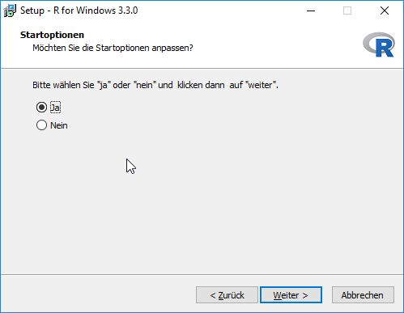
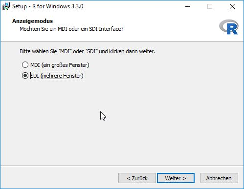
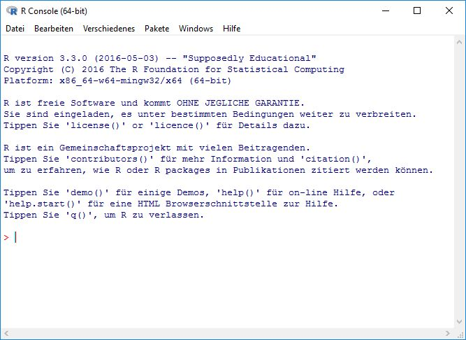
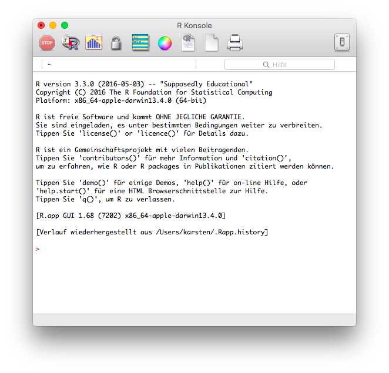
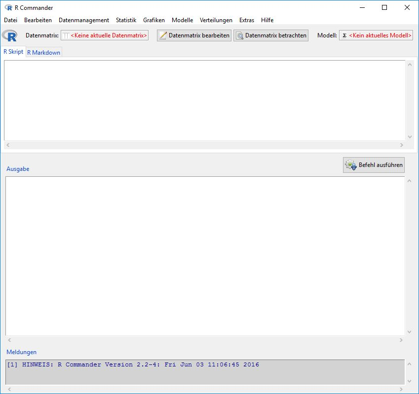
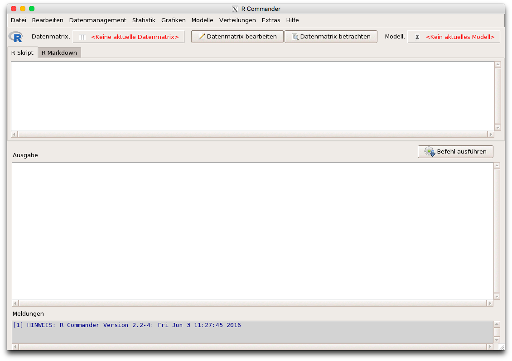

Installation von R und R Commander
================
Karsten Lübke

Vorbereitungen und Hinweise
---------------------------

Während der gesamten Installation sollten Sie eine stabile Internetverbindung haben. Für die Installation müssen Sie ein wenig Zeit einplanen, der Aufwand ist aber nur einmalig nötig! Bitte beachten Sie diese Hinweise. Bei Problemen können Sie sich, bitte mit einer möglichst genauen Beschreibung (z. B. Fehlermeldung, Betriebssystem etc.), an <R@fom.de> wenden.

-   [**R**](https://www.r-project.org/) ist das Basisprogramm
-   [**R Commander**](http://socserv.socsci.mcmaster.ca/jfox/Misc/Rcmdr/) ist ein Zusatzpaket für R, welches eine grafische Benutzeroberfläche für einen wichtigen Teil der Funktionalität von R zur Verfügung stellt

### Windows

Sie müssen *keine* Administrationsrechte besitzen um R installieren zu können. Sie können in Ihr lokales Verzeichnis oder aber auch z. B. auf einen USB-Stick installieren.

### Mac OS X

Einige Zusatzpakete wie z. B.`Rcmdr` benötigen das X11 Windows System. Dies muss vorab - sofern noch nicht vorhanden - von der Seite <http://www.xquartz.org/> installiert werden. Nach der Installation muss der Computer neu gestartet werden. Neuere Versionen von R werden nur noch für OS X ab Version 10.9 (Mavericks) oder neuer zur Verfügung gestellt. Daher lohnt sich auch aus diesem Grund evt. ein Update.

1.  Installation [XQuartz](http://www.xquartz.org/)
2.  Neustart Computer
3.  Fortfahren mit der Installation von R

### Linux

Keine besonderen Vorbereitungen nötig.

Installation
------------

Installieren Sie zunächst R und anschließend aus R heraus den R Commander.

### Installation von R

Installieren Sie die für Ihr System aktuelle Version von R von der Seite

<https://www.r-project.org/>.

Welchen "Mirror" (Server) Sie verwenden ist dabei egal, z. B. den Cloud Mirror von R Studio:

1.  Windows: <https://cran.rstudio.com/bin/windows/base/>
2.  Mac OS X: <https://cran.rstudio.com/bin/macosx/>

#### Windows

Da der R Commander stabiler im sogenannten "single-document interface" (sdi) Modus läuft, sollten die Startoptionen entsprechend angepasst werden:





### Installation von Zusatzpaketen

Die Grundinstallation ist jetzt abgeschlossen. Und Sie können R durch klicken auf das Programm bzw. das Icon mit dem Logo starten. (Die ausführbare Datei finden Sie dabei im Ordner `bin` des Verzeichnisses, in dem Sie R installiert haben. Unter Linux können Sie R im Terminal durch den Befehl `R` starten.) Auf ihren Bildschirm sollte folgendes Bild zu sehen sein (Windows):



Bzw. Mac OS X:



#### R Commander

Zu Verwendung der grafischen Oberfläche R-Commander bitte zunächst zur Installation den Befehl eingeben:

``` r
install.packages("Rcmdr")
```

**Hinweis:** Bei der Verwendung von MAC OS X bitte unbedingt *vorher* die Hinweise zur [Vorbereitung der Installation](#anchor) beachten.

Hier werden einige weitere abhängige Pakete installiert, so dass es ein wenig dauern kann. Eventuell werden Sie beim erstmaligen Start des R Commanders über

``` r
library(Rcmdr)
```

gefragt, dass weitere Pakete installiert werden sollen. Dem können Sie zustimmen.

[Hier](http://socserv.socsci.mcmaster.ca/jfox/Misc/Rcmdr/installation-notes.html) gibt es weitere Hinweise zur Installation des R Commanders.

Unter **Mac OS X** kann es sein, dass der R Commander teilweise sehr langsam wird. Dies können Sie im R Commander Menü über `Extras -> MAC OS X app nap für R.app managen ...` verhindern, in dem Sie die Option `aus` wählen.

Wenn die Installation erfolgreich war erscheint der R Commander:

Windows:



Mac OS X:



Bei Problemen können Sie sich, bitte mit einer möglichst genauen Beschreibung (z. B. Fehlermeldung, Betriebssystem etc.), an <R@fom.de> wenden.

Pakete verwenden
----------------

In und für R gibt es sehr, sehr viele Zusatzpakete, z. B. `Rcmdr`. Jedes Zusatzpaket wird über den Befehle `library()` gestartet. Starten Sie also immer den R Commander über den Befehl:

``` r
library(Rcmdr)
```

**Achtung:** R unterscheidet zwischen Groß- und Kleinbuchstaben, also resultiert

``` r
library(RCmdr)
```

    ## Error in library(RCmdr): there is no package called 'RCmdr'

entsprechend in einem Fehler.

### Versionshinweise:

-   Datum erstellt: 2016-06-03
-   R Version: 3.3.0
-   Rcmdr Version: 2.2.4
