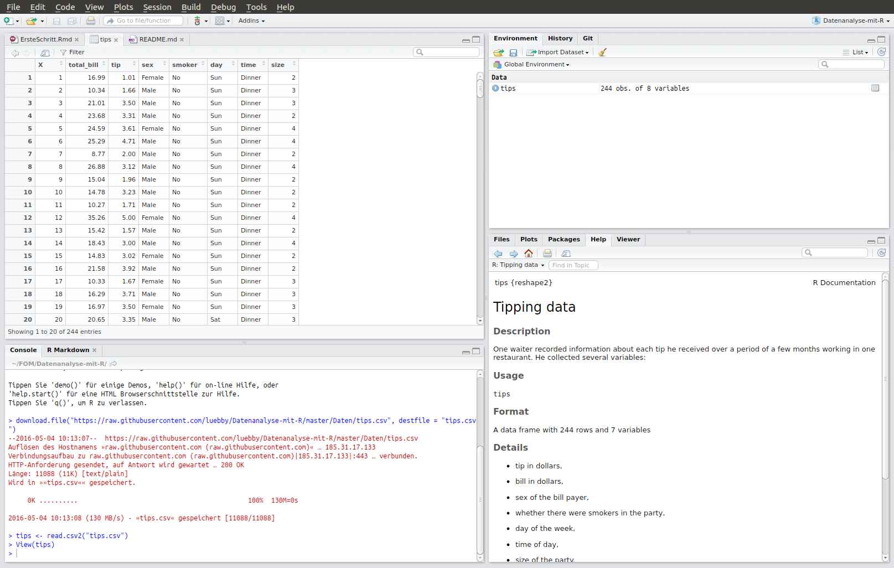

Erste Schritte in R
================

Hinweise
--------

**R** ist der Name der Programmiersprache für Statistik und Datenanalyse, **R Studio** ist eine konfortable Entwicklungsumgebung für R.

Nach dem Start von R Studio erscheint folgender Bildschirm  Links, in der *Console* werden die Befehle eingegeben, Rechts oben können Sie z. B. die Daten, aber auch andere Objekte mit denen Sie arbeiten, betrachten, auch die Historie der Befehle wird dort angezeigt. Rechts unten können Sie u. a. Dateien und Abbildungen auswählen, aber auch Hilfeseiten und Tipps betrachten.

Wir werden zunächst in der Konsole arbeiten.

Ein paar Anmerkungen vorweg:

-   R unterscheidet zwischen Groß- und Kleinbuchstaben
-   R verwendet den Punkt `.` als Dezimaltrennzeichen
-   Kommentare werden mit dem Rautezeichen `#` eingeleitet
-   R wendet Befehle direkt an
-   R ist objektorientiert, d. h. derselbe Befehl hat evt. unterschiedliche Rückgabewerte
-   Hilfe zu einem Befehl erhält man über ein vorgestelltes Fragezeichen `?`
-   Zusätzliche Funktionalität kann über Zusatzpakete hinzugeladen werden. Diese müssen ggfs. zunächst vorher installiert werden
-   Mit der Pfeiltaste nach oben können Sie einen vorherigen Befehl wieder aufrufen

R als Taschenrechner
--------------------

Auch wenn Statistik nicht Mathe ist, so kann man mit R auch rechnen. Geben Sie zum Üben die Befehle in der R Konsole hinter der Eingabauforderung `>` ein und beenden Sie die Eingabe mit `Return` bzw. `Enter`.

``` r
4+2
```

    ## [1] 6

Das Ergebnis wird direkt angezeigt. Bei

``` r
x <- 4+2
```

erscheint zunächst kein Ergebnis. Über `<-` wird der Variable `x` der Wert `4+2` zugewiesen. Wenn Sie jetzt

``` r
x
```

eingeben wird Ergebnis

    ## [1] 6

angezeigt. Sie können jetzt auch mit `x` weiterrechnen.

``` r
x/4
```

    ## [1] 1.5

Vielleicht fragen Sie sich was die `[1]` vor dem Ergebnis bedeutet. R arbeitet vektororientiert, und die `[1]` zeigt an, dass es sich um das erste (und hier auch letzte) Element des Vektors handelt.

R zur Datenanalyse
------------------

Wir wollen R aber als Tool zur Datenanalyse verwenden. Daher müssen wir zunächst Daten einlesen. Zunächst laden wir die Daten herunter

``` r
download.file("https://raw.githubusercontent.com/luebby/Datenanalyse-mit-R/master/Daten/tips.csv", destfile = "tips.csv")
```

R hat die Datei jetzt im lokalen Verzeichnis unter den Namen `tips.csv` gespeichert.

[Hier](https://github.com/luebby/Datenanalyse-mit-R/blob/master/Daten/tips-help.pdf) können Sie mehr über die Daten erfahren.

Wo das lokale Verzeichnis ist, können Sie über

``` r
getwd()
```

erfahren. Das Einlesen von `csv` Dateien erfolgt über

``` r
tips <- read.csv2("tips.csv")
```

Der Datensatz `tips` taucht jetzt im `Enviroment` Fenster Rechts oben in R Studio auf. Durch Klicken auf den Namen können Sie diese betrachten. 

------------------------------------------------------------------------

Diese Übung basiert teilweise auf Übungen zum Buch [OpenIntro](https://www.openintro.org/stat/index.php?stat_book=isrs) von Andrew Bray und Mine Çetinkaya-Rundel unter der Lizenz [Creative Commons Attribution-ShareAlike 3.0 Unported](http://creativecommons.org/licenses/by-sa/3.0).
